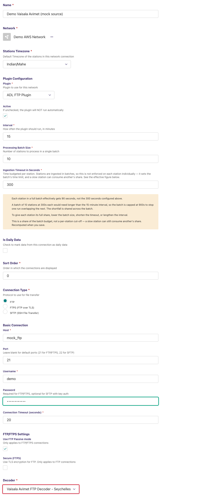
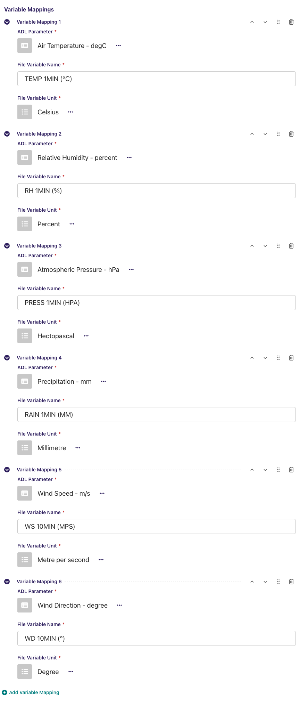
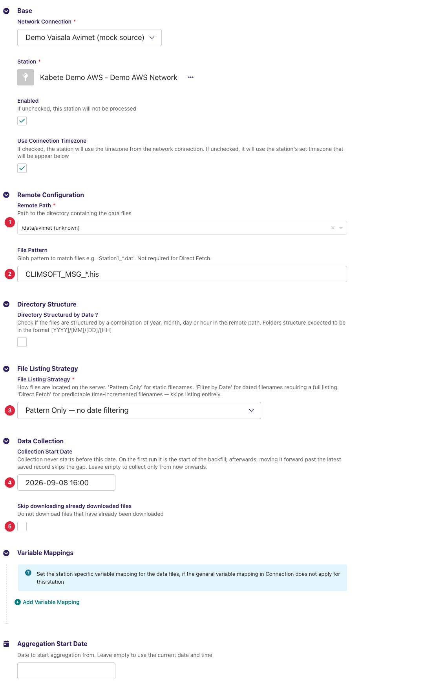
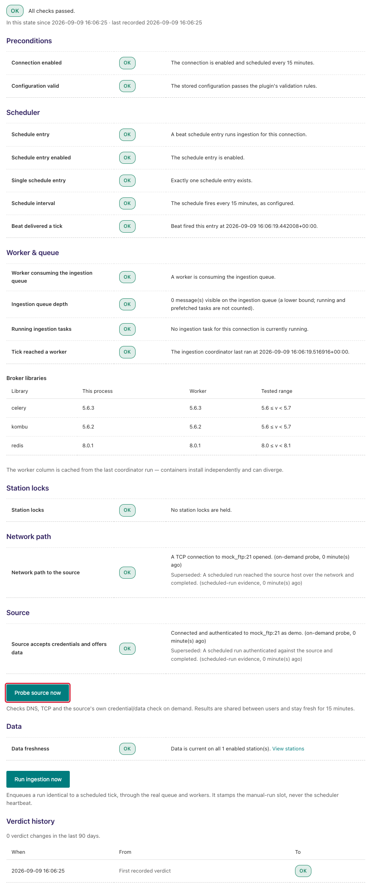
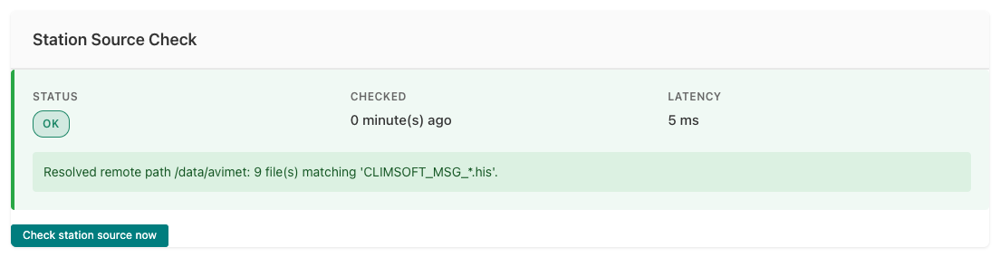
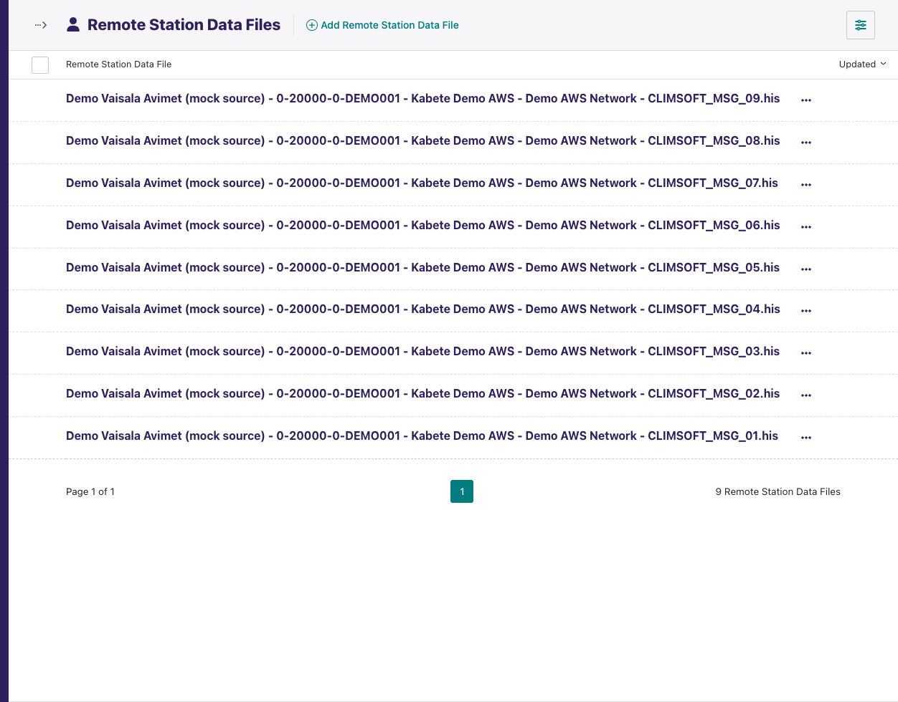

---
adl_plugin:
  name: ADL Vaisala SC FTP Decoder
  connects_to: FTP decoder for Vaisala Avimet AWS
  category: country
  country: Seychelles
  country_flag: "🇸🇨"
---
# ADL Vaisala SC FTP Decoder

Adds a **decoder** to the [ADL FTP Plugin](https://github.com/wmo-raf/adl-ftp-plugin)
for the daily history files that the **Vaisala Avimet** automatic weather
station of the Seychelles Meteorological Authority writes for CLIMSOFT: one
tab-separated file per day of the month, a `History file` banner line, a
header of parameter columns and one row per minute. With this plugin
installed, an ADL FTP/SFTP connection can select **Vaisala Avimet FTP Decoder
- Seychelles** as its decoder and collect those files like any other FTP
source.

**Repository:** [adl-vaisala-sc-ftp-decoder](https://github.com/seychelles-met/adl-vaisala-sc-ftp-decoder)
**Plugin type identifier:** `adl_vaisala_sc_ftp_decoder` (defined but not registered — see below)
**Decoder identifier:** `vaisala_avimet_sc` · **Decoder display name:** *Vaisala Avimet FTP Decoder - Seychelles*
**Connection model:** none of its own — uses the FTP plugin's `NetworkFTP` · **Station link model:** the FTP plugin's `FTPStationLink`

> **About the screenshots.** Every image in this guide is regenerated from
> `docs/screenshots.yml` against a seeded demo instance, so hostnames, station
> names, ids and readings in them are placeholders — not values to copy. The
> field tables are the reference for what to enter.

## Overview

This is a *decoder plugin*: it defines no connection or station link of its
own and never talks to a server. The FTP plugin does the listing and
downloading; this plugin turns each downloaded file into observation records
and, on top of the FTP plugin's pattern match, decides which day files to
take.

```
Vaisala Avimet ──▶ CLIMSOFT_MSG_<DD>.his on FTP ──▶ ADL FTP Plugin (list, match, download)
                                                            │
                                                            ▼
                                  Vaisala Avimet FTP Decoder - Seychelles (this plugin)
                                                            │
                                                            ▼
                                         records ──▶ variable mappings ──▶ ADL observations
```

The package ships a placeholder `Plugin` class (`adl_vaisala_sc_ftp_decoder`)
but never registers it, so it does not appear in the *Add connection* plugin
chooser. The connection's plugin is *ADL FTP Plugin*; this plugin appears only
as an entry in that connection's **Decoder** list. Everything about hosts,
credentials, paths, listing strategies, downloads and the monitoring screens
is documented in the
[ADL FTP Plugin guide](https://github.com/wmo-raf/adl-ftp-plugin/blob/main/docs/guide.md);
this guide covers what is specific to the Avimet files.

## Prerequisites

- A running ADL instance with the **ADL FTP Plugin** installed (this plugin
  imports from it and cannot load without it).
- FTP/SFTP access to the server the Avimet writes to — host, port, account,
  and the directory holding the files (see the FTP plugin guide's
  prerequisites for the network side).
- Files in the expected layout (next section).

## Installation

Installed like any ADL plugin — see [Plugin Installation](https://adl-tool.readthedocs.io/en/latest/developer_guide/plugins/plugin_installation.html) for
all methods. Both entries are needed in `plugins.toml`, the FTP plugin first:

```toml
[[plugins]]
name = "ADL FTP Plugin"
git  = "https://github.com/wmo-raf/adl-ftp-plugin.git"
tag  = "0.13.0"

[[plugins]]
name = "ADL Vaisala SC FTP Decoder"
git  = "https://github.com/seychelles-met/adl-vaisala-sc-ftp-decoder.git"
tag  = "0.2.1"
```

After rebuild/restart, confirm both appear in `docker compose exec adl
list-plugins`, and that *Vaisala Avimet FTP Decoder - Seychelles* is offered
in the Decoder list of a new FTP connection.

## The file format this decoder reads

| Aspect | Expected |
|---|---|
| File name | One file per **day of the month**, named with the two-digit day: `CLIMSOFT_MSG_10.his` for the 10th. The same name is reused every month. |
| Encoding / separators | Text, **tab**-separated. |
| Line 1 | A banner (`History file`) that the decoder skips. |
| Line 2 | The column headers, e.g. `TIMESTAMP`, `TEMP 1MIN (°C)`, `TEMPMAX 24H (°C)`, `TEMPMIN 24H (°C)`, `RH 1MIN (%)`, `DP 1MIN (°C)`, `WS 1MIN (MPS)`, `WD 1MIN (°)`, `WS 2MIN (MPS)`, `WD 2MIN (°)`, `WS 10MIN (MPS)`, `WD 10MIN (°)`, `WSMAX 1MIN (MPS)`, `WDMAX 1MIN (°)`, `WSMAX 10MIN (MPS)`, `WDMAX 10MIN (°)`, `WSMAX 60MIN (MPS)`, `WDMAX 60MIN (°)`, `RAIN 1MIN (MM)`, `PRESS 1MIN (HPA)`, `QNH 1MIN (HPA)`, `QFF 1MIN (HPA)`, `QFE 1MIN (HPA)`, `QFE DIFF 3H (HPA)`, `MESSAGE TO CLIMSOFT`. Every header other than `TIMESTAMP` is a variable, and the header text — including the spaces and the unit in brackets — is its *File Variable Name*. |
| `TIMESTAMP` | `DD/MM/YYYY HH:MM`, read as the station's local time (the connection's *Stations Timezone*, or the station link's own). |
| Values | Numeric; a cell that is not a number (including the `MESSAGE TO CLIMSOFT` column) is stored as missing. |

## Connection configuration

Create a **Network FTP/SFTP** connection exactly as the FTP plugin guide
describes (connection type, host, port, username, password, passive mode,
timeout), then:

| Field | Value for this source |
|---|---|
| Decoder | **Vaisala Avimet FTP Decoder - Seychelles** |
| CSV Configuration | Leave empty — this decoder needs no configuration. |
| Variable Mappings | One row per column to store (below). Connection-level mappings apply to every station on the connection. |



### Variable mappings

| Field | Description |
|---|---|
| ADL Parameter | The ADL `DataParameter` the values are stored under. |
| File Variable Name | The column header **exactly** as in the file, including spaces, case and the bracketed unit: `TEMP 1MIN (°C)`, `WS 10MIN (MPS)`, `RAIN 1MIN (MM)`. |
| File Variable Unit | The unit named in the header: `degC`, `%`, `m/s`, `degree`, `mm`, `hPa`. |

**Example:** ADL Parameter `Air Temperature` ← File Variable Name `TEMP 1MIN
(°C)`, unit `degC`; ADL Parameter `Wind Speed` ← `WS 10MIN (MPS)`, unit
`m/s`.

The FTP plugin's **Test Decoder Configuration** action on the connection row
decodes one uploaded file and shows the record keys — use it to copy the
headers rather than retyping them.



## Station link configuration

Create an **FTP/SFTP Station Link** per station (all fields are the FTP
plugin's; only the values matter here):

| Field | Value for this source |
|---|---|
| Remote Path | The directory the Avimet writes into. |
| File Pattern | `CLIMSOFT_MSG_*.his`. |
| Directory Structured by Date | Off. |
| File Listing Strategy | **Pattern Only**. Do not use *Filter by Date*: the file names carry only a day number, which the FTP plugin's filename-date filter cannot parse, so it would drop every name. |
| Collection Start Date | Leave **empty** for routine collection: the decoder then fetches **today's file only** (see below). Set it only for a backfill, which makes every day file in the directory be fetched on each run. |
| Skip downloading already downloaded files | **Off**. Today's file grows through the day and every file name is reused next month; with this on, a name fetched once would never be fetched again. |



## Admin UI added by this plugin

None. This plugin adds no page, menu entry, button or form of its own; the
only place it appears is as an option in the FTP connection's *Decoder*
select. The FTP plugin's own surfaces — *Test Decoder Configuration*, the
*Direct Fetch Files* preview, the *FTP station data files* list — work with
this decoder and are documented in the FTP plugin guide.

## Data collection behavior

One run, per enabled station link:

1. The FTP plugin lists *Remote Path* and keeps the names matching *File
   Pattern*.
2. This decoder narrows them: with **no** *Collection Start Date*, only the
   names containing today's two-digit day (in the station's timezone) are
   kept; with a start date, **every** matching name is kept.
3. Each kept file is downloaded (every run, with *Skip downloading already
   downloaded files* off) and handed to the decoder, which skips the banner,
   converts each column to numbers and yields one record per row.
4. ADL applies the variable mappings and unit conversion and stores the
   values; rows already stored are updated, not duplicated. Rows older than
   *Collection Start Date* are rejected.

- **Routine operation (no start date):** today's file, re-read each run.
  Yesterday's file is not looked at after midnight, so rows written to it
  late are lost — keep the collection interval short.
- **Backfill (start date set):** all 28–31 day files are downloaded on every
  run, each carrying whatever month the Avimet last wrote it in. Rows before
  the start date are rejected; the rest are stored. Clear the start date
  again once the backfill is done, otherwise every run keeps re-downloading
  the whole directory.
- **Timezones:** file times are local station time; the station's timezone
  (connection default or per-link) is what ADL stamps them with, and what
  "today" is computed in.

## Source checks / diagnostics

All monitoring for a connection using this decoder is the FTP plugin's: the
**Ingestion Diagnostic** page proves the FTP host, port and account, and the
station link's **Station Source Check** proves the resolved remote path and
counts the files matching the pattern (before this decoder's day filter, so
it usually reports all the month's files while a run fetches one). How to
read both screens is covered in
[Monitoring & Diagnostics](https://adl-tool.readthedocs.io/en/latest/user_guide/monitoring_and_diagnostics.html);
their FTP-specific messages are catalogued in the FTP plugin guide. This
plugin adds no check of its own.







### Feedback catalogue — messages involving this decoder

The decoder itself logs nothing; what an operator sees comes from the FTP
plugin's pipeline, in the station's activity log or task log:

| Message (example) | Where | Meaning | What to do |
|---|---|---|---|
| `No files found for station … matching pattern 'CLIMSOFT_MSG_*.his' in path /avimet` | task log (debug) | Nothing matched the pattern **and** today's day number (no start date set). | Normal just after midnight before the Avimet creates the file; otherwise check the pattern and the directory. |
| `Error decoding file CLIMSOFT_MSG_10.his: time data '10/04/2025' doesn't match format '%d/%m/%Y %H:%M'` | task log (error) | A `TIMESTAMP` cell is not `DD/MM/YYYY HH:MM`. | Open the file; the Avimet's export format changed or a row is corrupt. |
| `Error decoding file …: 'TIMESTAMP'` | task log (error) | The header row has no `TIMESTAMP` column — the banner line is missing (so the header was skipped) or the file is a different export. | Check that line 1 is the banner and line 2 the headers. |
| `File CLIMSOFT_MSG_10.his decoded 1440 record(s) but none of its values were saved — check the variable mappings and the ingestion window` | task log (warning) | Rows decoded, but no *File Variable Name* matched a header, or all rows lie before *Collection Start Date*. | Copy the headers from *Test Decoder Configuration*; check the start date. |
| `Resolved remote path /avimet: 31 file(s) matching 'CLIMSOFT_MSG_*.his'.` | Station Source Check (OK) | The FTP plugin's station check: path found, all day files match the pattern. | Fine; a run fetches today's. |

## Troubleshooting

**Today's data stops updating after the first fetch of the day**
: *Skip downloading already downloaded files* is on. Turn it off — the name
  is reused daily and monthly, so the ledger would never fetch it again.

**Every run downloads thirty files**
: A *Collection Start Date* is set, which switches the decoder to "all
  files". Clear it after the backfill.

**Yesterday's last minutes are missing**
: Only today's file is fetched without a start date; rows the Avimet
  appended to yesterday's file after midnight are never read. Collect
  frequently, or set a start date briefly to pick them up.

**Files decode but *values saved* is 0**
: The mapping names differ from the headers — most often the degree sign or
  the bracketed unit. Copy them from *Test Decoder Configuration*.

**Missing cells appear as `NaN` in the data viewer**
: This release reads the file with pandas and passes an empty or non-numeric
  cell through as a floating-point *NaN*. Whether that reaches the database
  depends on the ADL core version: core up to 0.8.x stores it as a number,
  so it shows in the viewer as `NaN`; later core versions skip non-finite
  values like any other absent reading. Either way a `NaN` is **not** an
  observation — treat it as a gap, not a measurement. If your instance shows
  them, upgrading core removes them from new collections; values already
  stored stay until they are cleared.

## Compatibility

| Plugin version | Requires | Notes |
|---|---|---|
| 0.2.1 | ADL FTP Plugin >= 0.10.0 (written against 0.13.0), ADL core 0.8.x; `pandas` (present in the ADL core image) | Current release. Accepts the FTP plugin's dated `get_matching_files()` call. |

## Changelog

See [GitHub Releases](https://github.com/seychelles-met/adl-vaisala-sc-ftp-decoder/releases).
